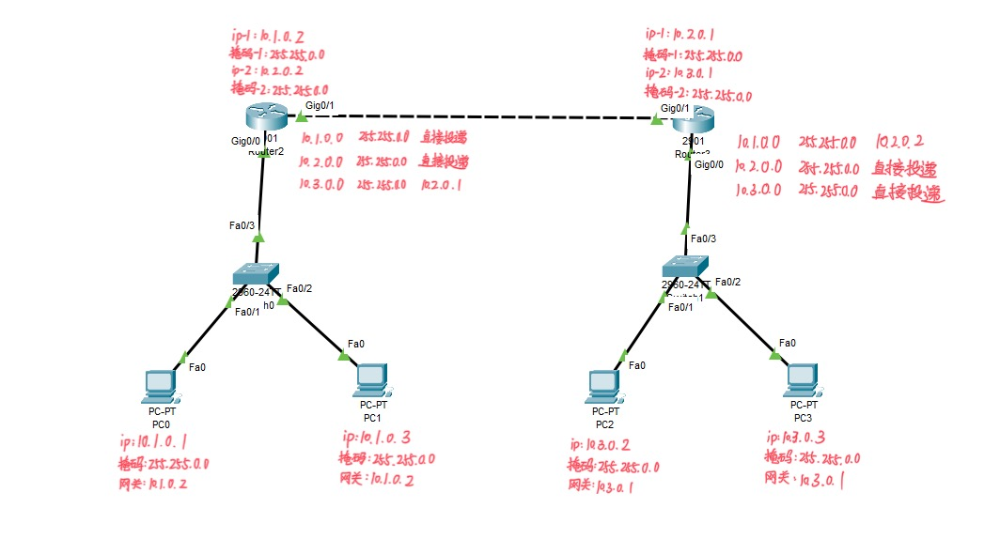

# 实验4：互联网组网与路由器配置

姓名：张刘明    学号：2110049

## 实验内容及要求：

### 实体环境下互联网组网与路由器配置

在实体环境下完成互联网组网与路由器配置，要求如下：

1. 在机房实验室环境下，通过将局域网划分为不同子网，用多IP主机作为路由器，组建互联网。

2. 在命令行方式下，按照静态路由方式，配置路由器和主机，测试互联网的连通性。

### 仿真环境下的互联网组网与路由器配置

在仿真环境下完成互联网组网与路由器配置，要求如下：
1. 学习路由器的配置方法和配置命令。
2. 参考实体实验，组建由多个路由器组成的互联网。物理网络可以由集线器、交换机构成。
3. 按照静态路由方式配置路由器和主机，测试互联网的连通性。
4. 利用动态路由方式配置路由器和主机，测试互联网的连通性。
5. 在仿真环境的“模拟”方式中观察数据包在互联网中的传递过程，并进行分析。

## 实验过程

### 仿真环境下的互联网组网与路由配置

#### 根据要求在Cisco Packet Tracer中建立组网拓扑结构

1. 静态路由拓扑结构配置

2. 动态路由拓扑结构配置

#### 配置过程

##### 静态路由部分

1. 配置路由设备的IP地址

给静态路由Router2和Router3设置IP地址，由于路由设备需要连接2个或2个以上的⽹络，因此需要设置多个IP地址

- router2:

在CLI中配置如下：

- router3:

在CLI中配置如下：

2. 为路由器添加路由表项

在全局配置模式下使⽤如下命令给 Router2、Router3 增加路由表项  
R2：``ip route 10.3.0.0 255.255.0.0 10.2.0.1``  
R1：``ip route 10.1.0.0 255.255.0.0 10.2.0.2``  
再退回到特权执⾏模式，⽤ show ip route 查看路由表，如下，均添加成功

- router2:

- router3:

3. 测试网络连通性

ip为``10.1.0.1``的主机执行指令``ping 10.3.0.3``和指令``tracert 10.3.0.2``如下：

结果显示网络联通。

##### 动态路由部分

动态路由可以通过⾃⾝的学习，⾃动修改和刷新路由表。

在互联⽹中RIP是⼀个经常使⽤的动态路由选择协议，适合在中⼩型互联⽹上使⽤。

1. 配置路由器接⼝的IP地址

单击需要配置的路由器，在弹出的配置界⾯选择CLI。使⽤enable命令进⼊路由器的特权执⾏模式，然后使⽤config terminal 进⼊全局配置模式，通过interface进⼊特定接⼝的配置模式。配置路由器的IP地址的命令``ip address IP 地址 掩码``，利⽤命令``no shutdown``保证使⽤的接⼝处于激活状态。具体配置命令如下图所示：

- router2:

- router3:

2. RIP的配置

RIP的配置需要在全局配置模式下进⾏。在全局配置模式下运⾏router rip 命令进⼊RIP配置模式，利⽤version2命令通知系统使⽤的RIP版本为可以处理⼦⽹编址的Version2版本。使⽤network命令说明路由器直接相连的⽹络，最后使⽤show ip route命令查看路由器是否获得了正确的路由。

- router2:

- router3:

3. 测试网络连通性

成功。